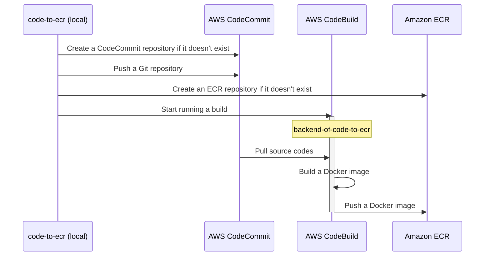

code-to-ecr
===========

Docker Image Builder using AWS CodeBuild

[](https://github.com/dceoy/code-to-ecr/actions/workflows/lint.yml)



Installation
------------

1.  Install [AWS CLI](https://aws.amazon.com/cli/) and set `~/.aws/config` and `~/.aws/credentials`.

2.  Install [git-remote-codecommit](https://github.com/aws/git-remote-codecommit).

3.  Check out the repository.

    ```sh
    $ git clone git@github.com:dceoy/code-to-ecr.git
    ```

4.  Deploy AWS CloudFormation stacks for AWS CodeBuild.

    ```sh
    $ cd code-to-ecr
    $ aws cloudformation create-stack \
        --stack-name backend-of-code-to-ecr \
        --template-body file://backend-of-code-to-ecr.cfn.yml \
        --capabilities CAPABILITY_NAMED_IAM
    ```

Usage
-----

```sh
$ ./code-to-ecr <git_repo_path> <codecommit_repo_name> <image_repo_name>
```

Run `./code-to-ecr --help` for more information.
